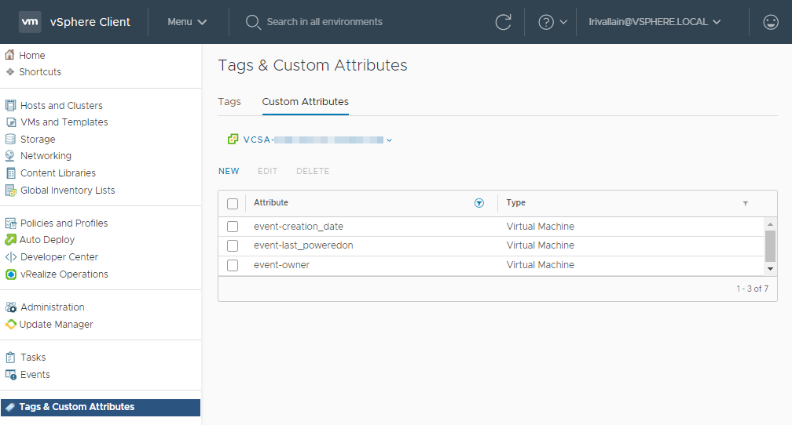

# kn-vm-creation-attr-fn

> This function is greatly inspired by the content from [embano1/kn-echo](https://github.com/embano1/kn-echo) and
> [lrivallain/openfaas-fn/.../vm-creation-attr-fn](https://github.com/lrivallain/openfaas-fn/tree/master/vm-creation-attr-fn).

A sample python function with `Flask` REST API running in Knative to apply custom
attributes to a VM object based on an event submitted by the
[VEBA](https://vmweventbroker.io/) (VMware Event Broker) services.

In addition [Buildpacks](https://buildpacks.io) are used to create the
artifacts.

> **Note:** CloudEvents using structured or binary mode are supported.

## The use-case

The initial use-case is the following:

We have a lab vCenter with multiple users, multiple projects, PoC etc. And it’s a bit hard to know which VM belongs to which user, and if the project is still active.

A way I found to handle this, is to set Custom Attributes to the VM objects in vCenter, and to populate values when specific event occurs:

* `event-creation_date`: To store the creation date
* `event-last_poweredon`: To store the last powered on date
* `event-owner`: To store the user that created the VM


## Quick-start

### Pre-requisites

You need:

* A deployed VEBA instance (K8S based)
* A deployed knative setup
* A set of custom attributes applicable to VMs like the previous ones.
* This repository

A blog post is available on [vUptime blog](TODO:) with more details about previous steps.

# Configuration

Edit the content of `function.yaml` to configure the following settings:

```
# In `ConfigMap` section
VC_SERVER: vcsa.local
VC_USER: test@vsphere.local
VC_SSLVERIFY: True
VC_ATTR_OWNER: event-owner
VC_ATTR_CREATION_DATE: event-creation_date
VC_ATTR_LAST_POWEREDON: event-last_poweredon

# In `Secret` section
VC_PASSWORD: Vk13YXJlMSEK
```

**Note:** The following steps assume a working Knative environment using a broker named
`vmware-event-broker`. The Knative `service` and `trigger` will be installed in the
Kubernetes namespace specified in apply command, assuming that the broker is also available
there.

You can easly customizer the broker name by using the following command:

```bash
sed -i s/vmware-event-broker/NAMEOFYOURBROKER/ function.yaml
```

## Deploy

```bash
kubectl appy -n YOURNAMESPACE -f functions.yaml
```

# Build with `pack`

Requirements:

- `pack` (see: https://buildpacks.io/docs/app-developer-guide/)
- Docker

```bash
pack build lrivallain/kn-vm-creation-attr-fn --builder gcr.io/buildpacks/builder:v1
```

## Verify the image works by executing it locally

Create a `.env` file with configuration:

```bash
VC_SERVER=vcsa.local
VC_USER=test@vsphere.local
VC_PASSWORD='VMware1!'
VC_SSLVERIFY=False
VC_ATTR_OWNER=event-owner
VC_ATTR_CREATION_DATE=event-creation_date
VC_ATTR_LAST_POWEREDON=event-last_poweredon
```

Run a local container based on the `lrivallain/kn-vm-creation-attr-fn` image or the one you just built.

```bash
docker run -e PORT=8080 -it --rm -p 8080:8080 --env-file .env lrivallain/kn-vm-creation-attr-fn:latest

# now in a separate window or use -d in the docker cmd above to detach
curl -i localhost:8080
HTTP/1.0 200 OK
Content-Type: application/json
Content-Length: 62
Server: Werkzeug/1.0.1 Python/3.8.6
Date: Mon, 16 Nov 2020 11:54:43 GMT

{
  "message": "POST to this endpoint to echo cloud events"
}

# or using a fake event
curl -i -d@testevent.json localhost:8080

HTTP/1.1 100 Continue

HTTP/1.0 204 NO CONTENT
Content-Type: application/json
Server: Werkzeug/1.0.1 Python/3.8.6
Date: Wed, 17 Feb 2021 09:16:09 GMT

# you should see the following lines printed in the docker container
 * Serving Flask app "handler.py" (lazy loading)
 * Environment: development
 * Debug mode: on
 * Running on http://0.0.0.0:8080/ (Press CTRL+C to quit)
 * Restarting with stat
 * Debugger is active!
 * Debugger PIN: 138-375-841
172.17.0.1 - - [04/May/2021 14:08:00] "POST / HTTP/1.1" 204 -
2021-05-04 14:08:00,230 INFO werkzeug Thread-3 : 172.17.0.1 - - [04/May/2021 14:08:00] "POST / HTTP/1.1" 204 -
2021-05-04 14:09:18,462 DEBUG handler Thread-4 : "***cloud event*** {"attributes": {"specversion": "1.0", "id": "42516969-218a-406f-9ccc-db387befc4bf", 
"source": "https://vcsa.local/sdk", "type": "com.vmware.event.router/event", "datacontenttype": "application/json", "subject": "DrsVmPoweredOnEvent", "time": "2021-05-04T07:33:33.773581268Z", "knativearrivaltime": "2021-05-04T07:33:33.772937393Z"}, "data": {"Key": 992270, "ChainId": 992267, "CreatedTime": "2021-05-04T07:33:32.759Z", "UserName": "VSPHERE.LOCAL\\test-user", "Datacenter": {"Name": "Datacenter", "Datacenter": {"Type": "Datacenter", "Value": "datacenter-21"}}, "ComputeResource": {"Name": "Cluster01", "ComputeResource": {"Type": "ClusterComputeResource", "Value": "domain-c84"}}, "Host": {"Name": "esxi1.local", "Host": {"Type": "HostSystem", "Value": "host-34"}}, "Vm": {"Name": "TestVM", "Vm": {"Type": "VirtualMachine", "Value": "vm-596"}}, "Ds": null, "Net": null, "Dvs": null, "FullFormattedMessage": "DRS powered On TestVM on esxi1.local in Datacenter", "ChangeTag": "", "Template": false}
}
2021-05-04 14:09:18,464 DEBUG vcenter Thread-4 : Initializing vCenter connection...
2021-05-04 14:09:18,992 INFO vcenter Thread-4 : Connected to vCenter 10.6.29.7
2021-05-04 14:09:19,483 INFO handler Thread-4 : Apply attribute > event-last_poweredon
2021-05-04 14:09:19,774 DEBUG handler Thread-4 : End of event
172.17.0.1 - - [04/May/2021 14:09:19] "POST / HTTP/1.1" 204 -
2021-05-04 14:09:19,777 INFO werkzeug Thread-4 : 172.17.0.1 - - [04/May/2021 14:09:19] "POST / HTTP/1.1" 204 -
```